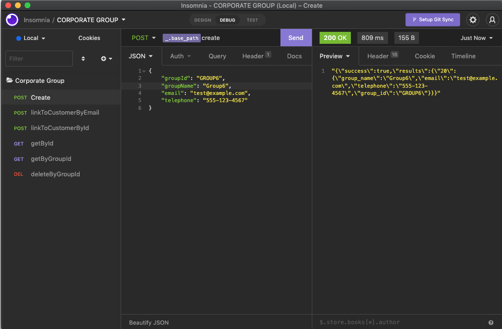

# Concentrix_CodeChallenge

## Description

Module made for a code challenge, for the recruitment of the company Concentrix.

This is a module for **Magento 2.4**. 

Basically it is a publicly exposed CRUD by REST API.

## Dependencies

- Magento_Customer
- Magento_Webapi

## How to consume the API REST

Since this web API is exposed to anonymous users, 
it can be accessed without need a token or any authentication.

The urls must be formed in the following way:

`http://<magento_url>/rest/V1/api/corporateGroups/{endpoint}`

To consume the API, you can either download a REST client (such as Postman or Insomnia) to make the corresponding requests, or you can perform a direct **curl** command.



[Download Insonmia Collection](Assets/corporate_group.json)

**Curl example**

```curl
curl -X 'POST' \
  'https://magento2.test/rest/V1/api/corporateGroups/create' \
  -H 'accept: application/json' \
  -H 'Content-Type: application/json' \
  -d '{
    "groupId": "string",
    "groupName": "string",
    "email": "string",
    "telephone": "string"
}'
```

## Manage Corporate Groups

These are the endpoints:

| ID  | Description                         | Method | Endpoint                                                 |
|-----|-------------------------------------|--------|----------------------------------------------------------|
| 1   | Create a new corporate group        | POST   | `rest/V1/api/corporateGroups/create`                     |
| 2   | Get Corporate Group                 | GET    | `rest/V1/api/corporateGroups/getByGroupId/{groupId}`     |
| 3   | Delete Corporate Group              | DELETE | `rest/V1/api/corporateGroups/deleteByGroupId/{groupId}`  |
| 4   | Search Corporate Group by entity_id | GET    | `rest/V1/api/corporateGroups/getById/{id}`               |
| 5   | Search Corporate Group by group_id  | GET    | `rest/V1/api/corporateGroups/getByGroupId/{groupId}`     |
| 6   | Link Corporate Group to Customer    | POST   | `rest/V1/api/corporateGroups/linkToCustomerById`         |

### 1. Create Corporate Group
**{base_path}/rest/V1/api/corporateGroups/create** `POST`

**Request example**

```json
{
    "groupId": "Group ID, should be unique and automatically cast to uppercase",
    "groupName": "Group Name or Label for select options",
    "email": "test@concentrix.com",
    "telephone": "555-123-4567"
}
```

### 2. Get Corporate Group
**{base_path}/rest/V1/api/corporateGroups/getByGroupId/{groupId}** `GET`

**Request example**

There is no request body for this, the **groupId** must be passed by URL

### 3. Delete a corporate group
**{base_path}/rest/V1/api/corporateGroups/deleteByGroupId/{groupId}** `DELETE`

**Request example**

There is no request body for this, the **groupId** must be passed by URL

### 4. Search Corporate Group by entity_id
**{base_path}/rest/V1/api/corporateGroups/getById/{id}** `GET`

**Request example**

There is no request body for this, the **id** must be passed by URL

### 5. Search Corporate Group by group_id
**{base_path}/rest/V1/api/corporateGroups/getByGroupId/{groupId}** `GET`

**Request example**

There is no request body for this, the **groupId** must be passed by URL

### 6. Link Corporate Group to Customer by ID
**{base_path}/rest/V1/api/corporateGroups/linkToCustomerById** `POST`

**Request example**

```json
{
    "groupId": "Group ID",
    "customerId": "Number of the Customer entity_id"
}
```
Example to associate group_id: **GROUP1** to Customer with entity_id: **2**:
```json
{
    "groupId": "GROUP1",
    "customerId": 2
}
```
### 7. Link Corporate Group to Customer by Email
**{base_path}/rest/V1/api/corporateGroups/linkToCustomerById** `POST`

**Request example**

```json
{
    "groupId": "Group ID",
    "email": "Customer email"
}
```
Example to associate group_id: **GROUP1** to Customer with email: **johndoe@example.com**:
```json
{
    "groupId": "GROUP1",
    "email": "johndoe@example.com"
}
```


